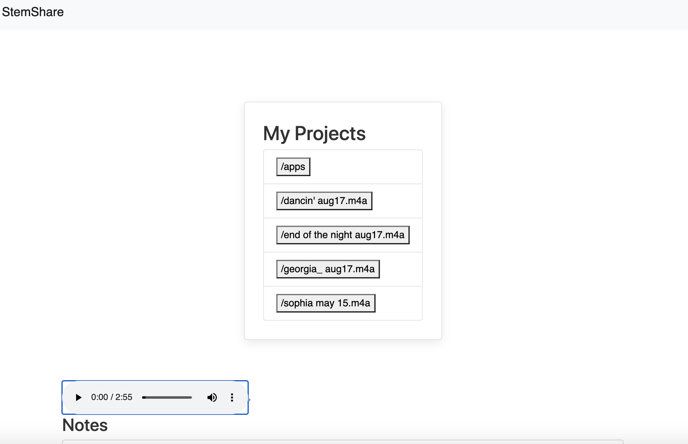

# StemShare

Stemshare is a MERN stack application that uses dropbox and react audio player to provide a music focused appplication for sharing projects.

github repo: https://github.com/bendrakeacker/StemShare

deployed link: https://ancient-shelf-77990.herokuapp.com/